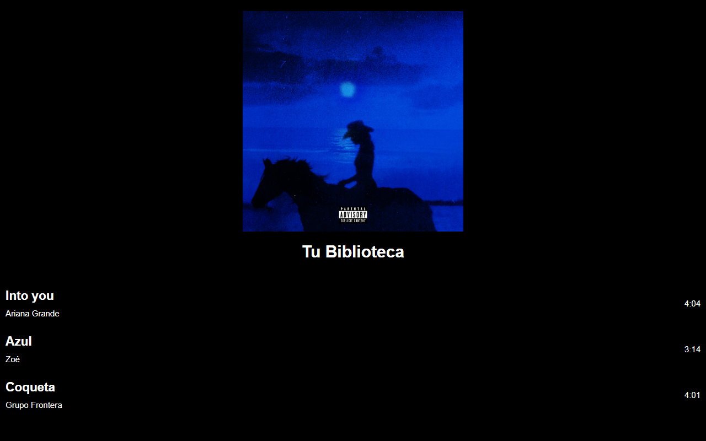

# Biblioteca musical


Primera versión de una biblioteca de música personal hecha con **React**. Muestra la imagen de perfil del usuario, el título de la biblioteca y una lista de canciones con artista y duración. Su evolución, con búsqueda en una API real y TypeScript, está en [Biblioteca-de-musica](https://github.com/Donaldo500/Biblioteca-de-musica).

## Captura de pantalla



## Descripción

El proyecto se centró en los fundamentos de React:

- **Componentes de clase** (`class ... extends Component`).
- **Estado local** inicializado en el constructor (`this.state`).
- **Ciclo de vida** con `componentDidMount`.
- **Renderizado de listas** con `map` y la prop `key`.
- **Props** para pasar información entre componentes.
- Estilos escritos en **SCSS** y compilados a CSS.

## Tecnologías utilizadas

| Tecnología | Uso |
| --- | --- |
| React 19 | Interfaz basada en componentes de clase |
| JavaScript (ES6+) | Lógica de los componentes |
| SCSS | Estilos (`src/app.scss` compilado a `src/App.css`) |
| Create React App | Entorno de desarrollo y build |

## Estructura del proyecto

```text
src/
├── App.js                 # Componente raíz
├── App.css / app.scss     # Estilos
└── components/
    ├── header.js          # Imagen y título de la biblioteca
    ├── song.js            # Lista de canciones (estado local)
    └── img/COQUETA.jpeg
```

## Instalación y uso

### Requisitos

- Node.js 18 o superior
- npm

### Pasos

```bash
git clone https://github.com/Donaldo500/Biblioteca-musical.git
cd Biblioteca-musical
npm install
npm start
```

La aplicación se abre en [http://localhost:3000](http://localhost:3000).

| Comando | Descripción |
| --- | --- |
| `npm start` | Servidor de desarrollo |
| `npm run build` | Build de producción en `build/` |
| `npm test` | Pruebas en modo interactivo |

## Ejemplos de uso

Para agregar canciones a la biblioteca, añade objetos al estado del componente `Songs` en `src/components/song.js`:

```js
this.state = {
  song: [
    { id: 1, songName: "Into you", artist: "Ariana Grande", duration: "4:04" },
    { id: 2, songName: "Azul",     artist: "Zoé",           duration: "3:14" },
    { id: 3, songName: "Coqueta",  artist: "Grupo Frontera", duration: "4:01" }
  ]
};
```

Si modificas `src/app.scss`, vuelve a compilarlo hacia `src/App.css` (por ejemplo con la extensión *Live Sass Compiler* de VS Code o con `npx sass src/app.scss src/App.css`).

## Contribuciones

Proyecto individual con fines de aprendizaje. Las sugerencias son bienvenidas mediante issues o pull requests.

## Autor

**Donaldo Ibarra** - [@Donaldo500](https://github.com/Donaldo500)
